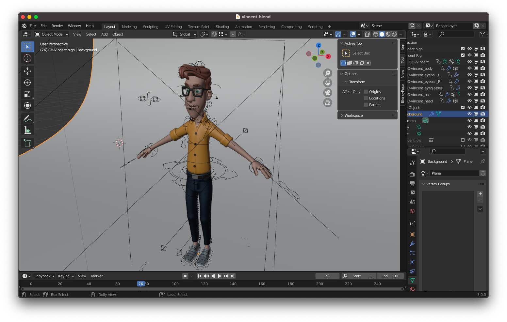
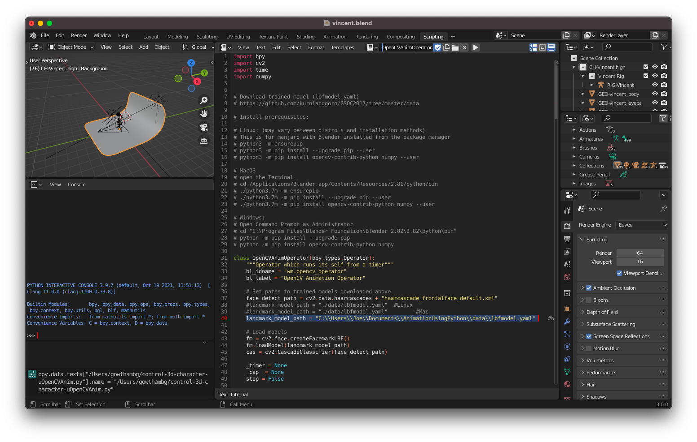
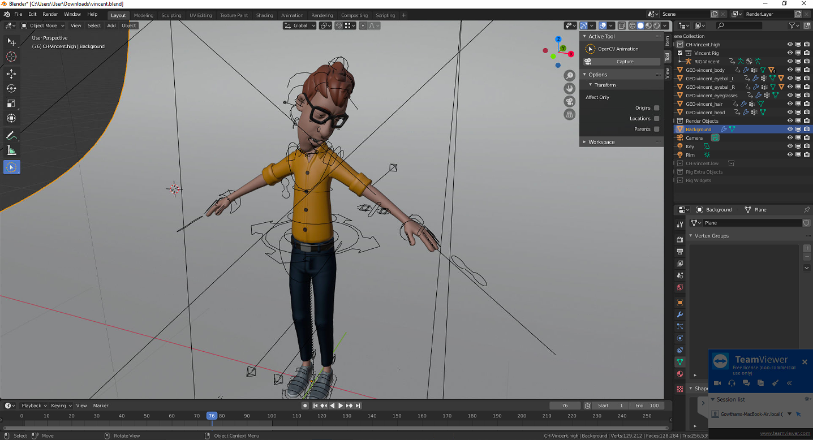

# Welcome

**Hi folks, this week we will be working to integrate blender animation with AI based model using python which makes the animation's face to mimic the movements of your face. Please follow the instructions given below to implement this project.**

# Prerequisities

**Please download these inorder to successfully implement the project**

1. Blender Version 2.8 - [Click Here](https://download.blender.org/release/Blender2.82/blender-2.82-windows64.msi)
1. Animation Character file - [Click Here](https://cloud.blender.org/p/characters/5718a967c379cf04929a4247)
1. AI Model - [Click Here](https://tinyurl.com/2p8ryysk)

# Steps to implement

1. Download Blender Version 2.8 from the link above and install it.
1. Then download both the Animation file and the AI model and extract it.
1. Open the downloaded Animation file and this should open the Vincent Character Animation in Blender. It should like this...
1. Then simply clone this Repo using the command **git clone https://github.com/ProtoHubs-io/Blender_FaceMesh.git** from your command prompt inorder to download the python scripts necessary to run the AI model.
1. Close the command prompt and open it again as administrator this time and enter the following 3 commands
   - **cd C:\Program Files\Blender Foundation\Blender 2.82\2.82\python\bin**
   - **python -m pip install --upgrade pip**
   - **python -m pip install opencv-contrib-python numpy**
1. Then go to the Animation file opened on Blender and click on the Scipting tab which will open you a code editor.
1. Here go to **Text->New** to create a new empty file. Now go to folder where you have cloned this repo and open **OpenCVAnim.py** file.
1. Copy the contents of this file to the blender code editor and rename the file name in code editor to the original filename(OpenCVAnim.py). **Save** this and click on **Run Script**
1. Again create a new file in code editor and this time copy the contents of **OpenCVAnimOperator.py** file and change the filename as OpenCVAnimOperator.py in code editor.
1. Before Saving this and running, don't forget to change the AI model file path which can be changed in the **landmark_model_path** variable as given in line 40 below...
1. The AI model will be a file named **lbfmodel.yaml** which will be present in the AI Model file which you have downloaded from the link given above. You need to paste the path of this file in **landmark_model_path** variable.
1. Then save, tick the Register option and **Run Script**. After this, click on layout tap which will zoom in the Animation.
1. Here you can see an option in left hand side called **OpenCV Animation**. Click on it you will see capture option on the right as given below
1. Click on **capture** which will turn on your video camera.
1. **Congragulations!**, Now move your face once the face mesh comes which will make the Vincent Animation automatically mimic your face.
